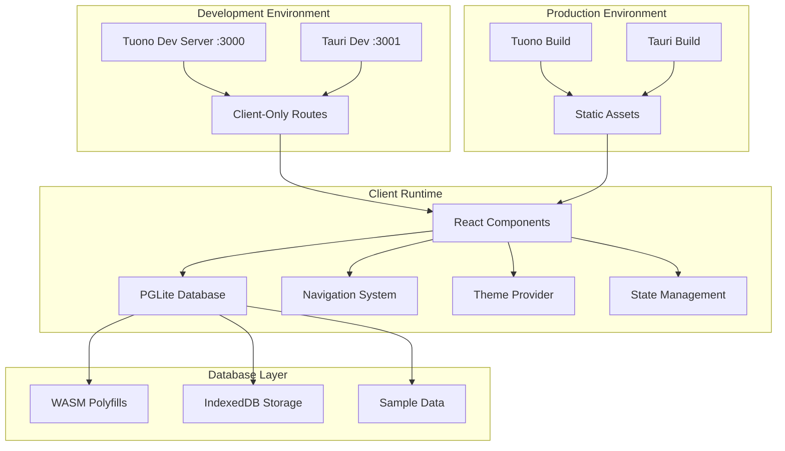

# Design Document

## Overview

The unified web-desktop functionality design establishes a robust, client-only architecture that ensures consistent behavior across both web (Tuono) and desktop (Tauri) deployment modes. The design leverages the existing client-only architecture that has successfully resolved hydration issues, while optimizing the build and runtime configurations for both development and production environments.

## Architecture

### High-Level Architecture



### Component Architecture

The application follows a strict client-only pattern with clear separation of concerns:

1. **Route Components**: Entry points that handle loading states and delegate to client components
2. **Client Components**: All interactive logic, state management, and UI rendering
3. **Layout Components**: Provide consistent structure and theme management
4. **Database Layer**: PGLite integration with proper WASM polyfill handling

## Components and Interfaces

### Core Components

#### 1. Route Components (`src/routes/`)
- **Purpose**: Minimal entry points for each page
- **Pattern**: Client-only with loading state handling
- **Interface**:
```typescript
interface RouteComponent {
  (props: TuonoRouteProps<{}>): JSX.Element;
  isLoading: boolean;
}
```

#### 2. Application Container (`src/components/application-container.tsx`)
- **Purpose**: Main layout with navigation and header
- **Features**: Sidebar navigation, loading states, error handling
- **Dependencies**: Navigation hooks, UI components, theme provider

#### 3. Root Client Layout (`src/components/root-client-layout.tsx`)
- **Purpose**: Theme provider wrapper for consistent theming
- **Pattern**: Client-only theme management
- **Interface**:
```typescript
interface RootClientLayoutProps {
  children: ReactNode;
}
```

#### 4. Database Manager (`src/lib/database.ts`)
- **Purpose**: PGLite integration with polyfill management
- **Features**: Singleton pattern, connection pooling, schema management
- **Interface**:
```typescript
interface DatabaseManager {
  initializeSimple(): Promise<void>;
  query(sql: string, params?: any[]): Promise<QueryResult>;
  getStats(): Promise<any>;
  isReady: boolean;
}
```

### Navigation System

#### Navigation Store (`src/stores/navigation.ts`)
- **Purpose**: Centralized navigation state management
- **Pattern**: Zustand store with client-only initialization
- **Features**: Route tracking, active state management, error handling

#### Navigation Hook (`src/hooks/use-navigation.ts`)
- **Purpose**: React hook interface for navigation operations
- **Features**: Navigation actions, current route detection, loading states

## Data Models

### Navigation Item Model
```typescript
interface NavigationItem {
  id: string;
  title: string;
  description: string;
  path: string;
  icon: string;
  isActive: boolean;
  metadata?: Record<string, any>;
}
```

### Database Models
```typescript
interface User {
  id: number;
  name: string;
  email: string;
  role: string;
  created_at: string;
}

interface Product {
  id: number;
  name: string;
  description: string;
  price: number;
  category: string;
  created_at: string;
}

interface Order {
  id: number;
  user_id: number;
  status: string;
  total: number;
  created_at: string;
}
```

## Error Handling

### Database Error Handling
1. **Polyfill Verification**: Check WASM polyfills before PGLite initialization
2. **Graceful Degradation**: Display error messages if database fails to initialize
3. **Retry Mechanisms**: Allow users to retry failed operations
4. **Logging**: Comprehensive error logging for debugging

### Navigation Error Handling
1. **Route Validation**: Ensure valid routes before navigation
2. **Fallback Routes**: Redirect to home page for invalid routes
3. **Loading States**: Show appropriate loading indicators during navigation
4. **Error Boundaries**: React error boundaries for component-level errors

### Build Error Handling
1. **Configuration Validation**: Validate build configurations before compilation
2. **Asset Optimization**: Proper handling of WASM and static assets
3. **Dependency Resolution**: Ensure all dependencies are properly bundled
4. **Environment Detection**: Different configurations for development and production

## Testing Strategy

### Unit Testing
- **Components**: Test individual React components in isolation
- **Hooks**: Test navigation and database hooks with mock data
- **Database**: Test database operations with in-memory instances
- **Utilities**: Test utility functions and helpers

### Integration Testing
- **Navigation Flow**: Test complete navigation workflows
- **Database Integration**: Test PGLite integration with real data
- **Theme Switching**: Test theme provider functionality
- **Build Process**: Test both web and desktop build processes

### End-to-End Testing
- **Web Application**: Test complete user workflows in browser
- **Desktop Application**: Test Tauri application functionality
- **Cross-Platform**: Ensure consistent behavior across platforms
- **Performance**: Test application performance and loading times

## Build Configuration

### Package Manager
- **Package Manager**: pnpm (specified in package.json with packageManager field)
- **Commands**: All npm scripts should be run with `pnpm` instead of `npm`

### Web Build (Tuono)
- **Development**: Hot reload with Vite dev server on port 3000 (`pnpm dev`)
- **Production**: Static site generation with optimized assets (`pnpm build`)
- **Configuration**: `tuono.config.ts` with Tailwind and TypeScript support

### Desktop Build (Tauri)
- **Development**: Separate Vite config on port 3001 to avoid conflicts (`pnpm dev:tauri`)
- **Production**: SPA build with relative paths for Tauri packaging (`pnpm build:tauri`)
- **Configuration**: `vite.tauri.config.ts` with Tauri-specific optimizations

### Asset Handling
- **WASM Files**: Proper bundling and loading of PGLite WASM assets
- **Static Assets**: Consistent asset paths for both web and desktop
- **Code Splitting**: Optimized chunk splitting for better performance
- **Polyfills**: Early initialization of WASM polyfills

## Performance Optimizations

### Client-Side Optimizations
1. **Lazy Loading**: Components loaded on demand
2. **Code Splitting**: Separate chunks for different routes
3. **Memoization**: React.memo and useMemo for expensive operations
4. **Virtual Scrolling**: For large data lists

### Database Optimizations
1. **Connection Pooling**: Singleton database manager
2. **Query Optimization**: Indexed queries and prepared statements
3. **Caching**: In-memory caching for frequently accessed data
4. **Batch Operations**: Bulk database operations where possible

### Build Optimizations
1. **Tree Shaking**: Remove unused code from bundles
2. **Minification**: Compress JavaScript and CSS
3. **Asset Optimization**: Optimize images and static assets
4. **Bundle Analysis**: Monitor bundle sizes and dependencies

## Security Considerations

### Client-Side Security
1. **Input Validation**: Validate all user inputs before processing
2. **XSS Prevention**: Sanitize dynamic content rendering
3. **State Management**: Secure state management practices
4. **Error Information**: Avoid exposing sensitive information in errors

### Database Security
1. **SQL Injection**: Use parameterized queries exclusively
2. **Data Validation**: Validate data before database operations
3. **Access Control**: Implement proper access control patterns
4. **Audit Logging**: Log database operations for security auditing

### Build Security
1. **Dependency Scanning**: Regular security audits of dependencies
2. **Asset Integrity**: Ensure asset integrity during build process
3. **Environment Variables**: Secure handling of environment variables
4. **Code Signing**: Sign desktop applications for distribution