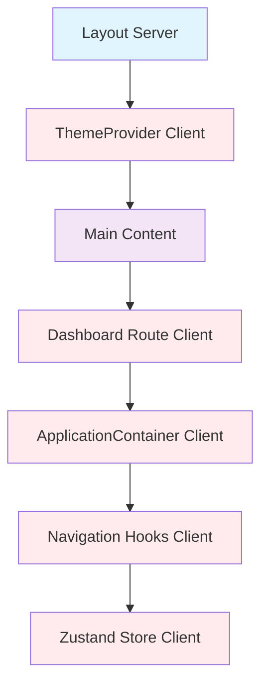
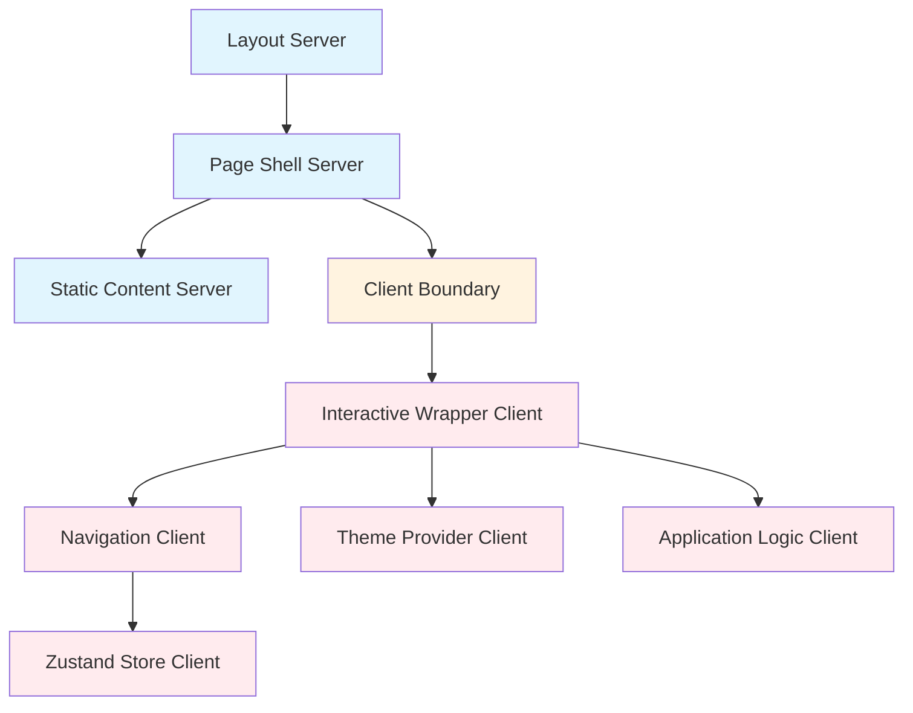

# React Server Components Architecture Diagram

## Current vs Target Architecture

### Current Architecture (Problematic)


### Target Architecture (Clean Separation)


## Component Responsibilities

### Server Components
- **Layout**: HTML structure, meta tags, scripts
- **Page Shells**: Static content, data fetching from Rust handlers
- **Content Components**: Static UI elements, data presentation

### Client Components  
- **Interactive Wrappers**: Components that need state/effects
- **Navigation System**: Routing, active states, user interactions
- **Theme Provider**: localStorage access, DOM manipulation
- **Database Clients**: WASM modules, real-time queries

## Data Flow Pattern
```mermaid
sequenceDiagram
    participant Server
    participant Client
    participant Browser
    
    Server->>Server: Fetch data from Rust handlers
    Server->>Server: Render page shell with static content
    Server->>Browser: Send HTML with server data
    Browser->>Client: Hydrate client components
    Client->>Client: Initialize state from server props
    Client->>Client: Handle user interactions