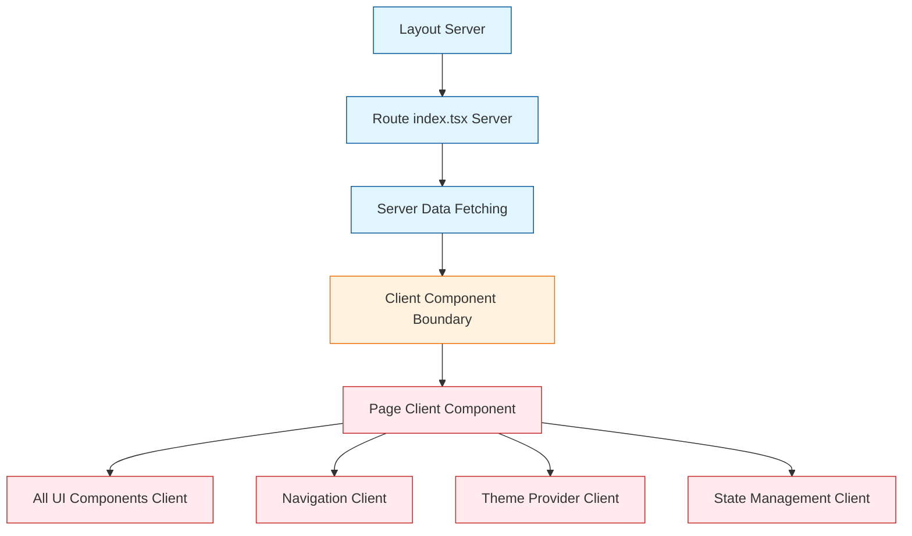
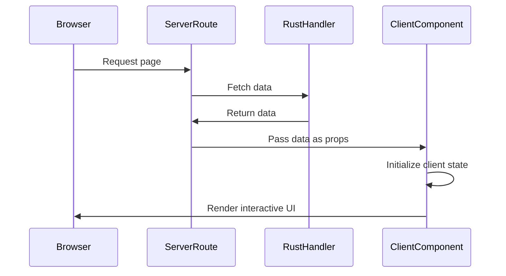

# Simplified React Server Components Architecture

## Architecture Philosophy: Server Shells + Client Apps

### Core Principle
- **Server Components**: Only route `index.tsx` files (minimal data-fetching shells)
- **Client Components**: Everything else (all components, logic, interactivity)

## Target Architecture



## File Structure Pattern

### Server Components (SSR)
```
src/routes/
├── index.tsx                 # Server: Landing page shell
├── dashboard/
│   ├── index.tsx            # Server: Dashboard shell
│   ├── data/index.tsx       # Server: Data page shell
│   └── database/index.tsx   # Server: Database shell
└── __layout.tsx             # Server: HTML layout
```

### Client Components (Interactive)
```
src/components/
├── landing-content.tsx       # Client: Landing page app
├── application-container.tsx # Client: Dashboard app
├── theme-provider.tsx       # Client: Theme management
├── database-client.tsx      # Client: Database interface
└── ui/                      # Client: All UI components
```

## Data Flow Pattern



## Benefits

1. **Clean SSR**: Server routes are minimal and predictable
2. **No Hydration Issues**: Clear server/client boundary
3. **Optimal Performance**: Server handles data, client handles interactivity
4. **Simple Mental Model**: Easy to understand what runs where
5. **Maintainable**: All complex logic is client-side where it belongs

## Implementation Strategy

1. Keep route `index.tsx` files as minimal server shells
2. Move all complex logic to client components
3. Pass server data as props to client components
4. Let client components handle all state and interactivity